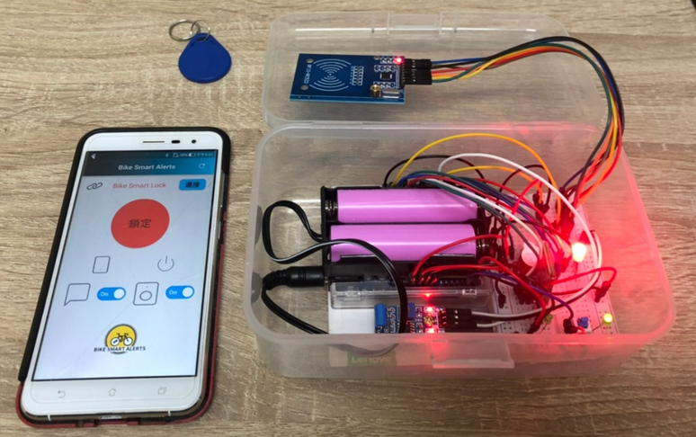
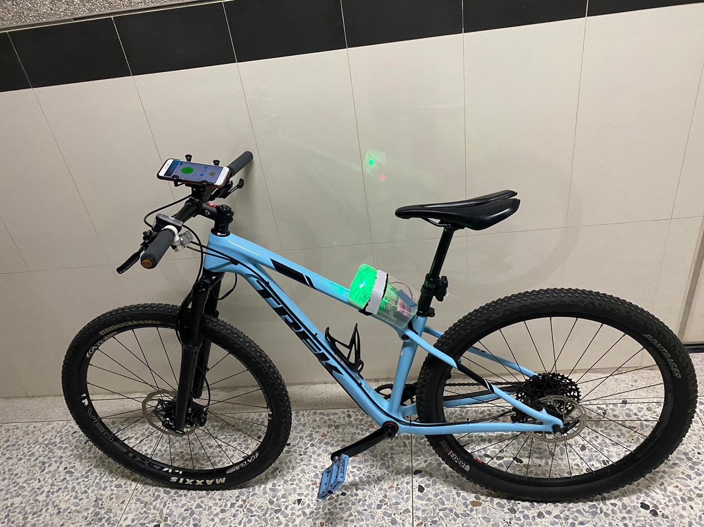

# 自行車防盜系統
</img>

## 勤益科大專題製作-自行車防盜系統-ARDUINO
用於連接自行製作的防盜警報裝置，
APP中包含藍芽搜尋列表、連結裝置功能，
搭配自製防盜警報裝置使用。
裝置使用Arduino uno、HC05、SW420、MFRC522製作。

## 裝置介紹
裝置透過RFID卡片或是手機進行開鎖解鎖，
鎖定狀態時會偵測裝置震動狀況，
受到晃動時觸發警報聲響及閃爍紅燈，
如果有連上app時傳送警報通知通知使用者。
### 裝置預覽
</img>
</img>
</img>

### 未來可修正增加的功能
* 目前僅用晃動感知器測試，未來改用G-sensor等等並連接資料庫做紀錄
* 僅用HC-05藍芽模組測試，須改用距離較遠的裝置
